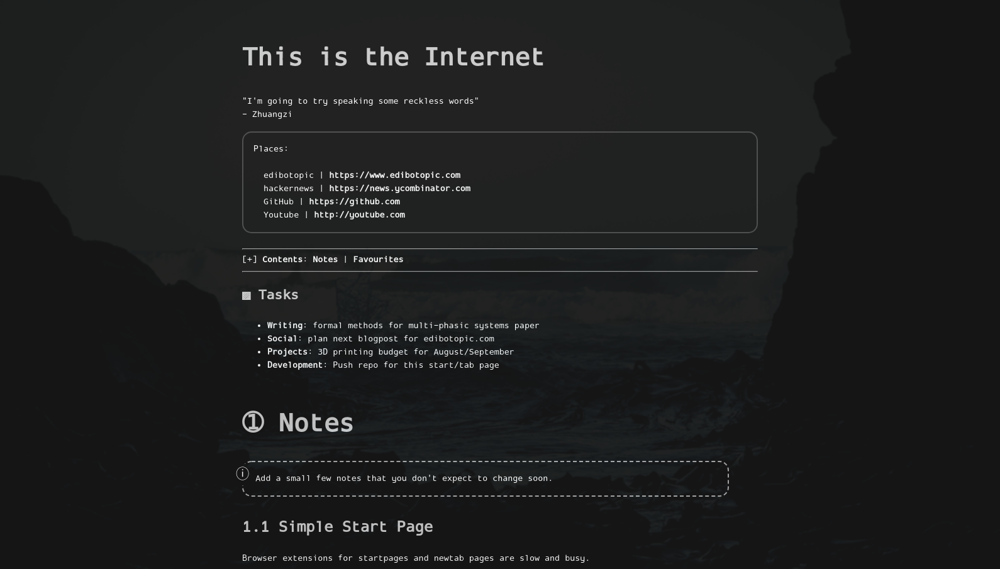
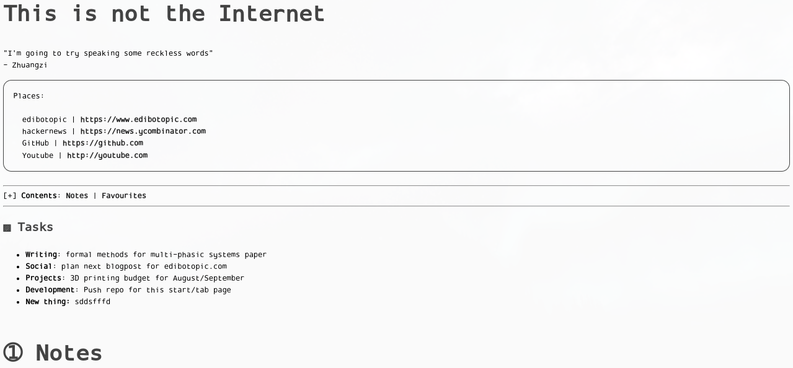

# Qute Start

A bare bones home page/new tab page that is friendly to light or dark modes.

Made for personal use and sharing across my own computers.

Developed primarily for use with [https://qutebrowser.org/](qutebrowser) but has been tested with Chrome where it has worked fine.

## Features

- Minimal text-based interface
- Live-editable text (_mostly_) with rich editing (bold, italic)
- Quote, links, tasks and favourites sections as default

## Purpose

I wanted a simple, minimal homepage that opens quickly, shows some links and includes a few live-editable notes.

I also wanted to move away from home page extensions that seem to be dominated by large clocks and landscape photography.

## Using

To start `git clone` the repo and note the _path_ to the `index.html`.
In your `config.py` for qutebrowser include the following lines:

```
c.url.default_page = 'file:///home/user/yourpathto/qute-start/index.html'
c.url.start_pages = 'file:///home/user/yourpathto/qute-start/index.html'
```

Note: it should be possible to something similar on other browsers but I have not checked in detail.

The `index.html` is **my** homepage and you will want to customise it.
Currently, almost all text can be edited in the browser **except for links**.
When you edit a text element and re-focus on another (or click elsewhere) the current state of the page will be saved to _local storage_.
Standard shortcuts for copying/pasting, bolding/italicising, etc., should work as normal.

Note: if you want to use keyboard shortcuts on the homepage (e.g., H, J, K, L movement keys in qutebrowser) you must ensure you are not focused on an editable text element.
Simply click just outside the outline that appears when you are text editing and it should work fine.

You will probably want to create your own page from scratch, however.
If so, delete mine and rename `template.html` to `index.html`.
Edit the `index.html` to add different links, styles, etc.

## Warning

I wouldn't advise relying on local storage for highly sensitive notes.

For security, you can periodically `save as` the webpage over the `index.html` to make the changes permanent.

~~In qutebrowser you simply need to type `gd` to invoke the *download* command with the homepage open in the active tab.~~
~~A prompt will then ask you to find where you want to download the `index.html`.
Choose the `/qute-start/` directory and save over the original file.~~

*Note: the above *should* work but resulted in my index.html being cleared completely first time around.
I have since tested again and it worked perfectly, so will try a few more times before recommending.*

This functionality might be incorporated as a button in the future if it doesn't clutter the page.

## Limitations

Pull requests welcome.

### Live-editable links

Would be nice to have editable links but this needs to be done in such a way that the hyperlinks remain clickable.
Should not be too difficult but is not a priority right now.

### Live-editing for adding new sections

Currently default sections like _Notes_ and _Favourites_ are numbered and hav a corresponding entry in a Table of Contents.

If you copy and paste _1.1 Simple Start Page_ in the browser and change it to _1.2 My Important Message_ then this will work fine but the Table of Contents will not be updated.

### Live-editing on Firefox

While this was made specifically for qutebrowser and isn't aiming for cross-browser compatibility this would still ne nice in principle.

When testing locally data was not being save to local storage reliably on Firefox but worked fine on Chrome.

## Credit

The `html` and `css` is inspired by the lovely [Pico-8 online manual](https://www.lexaloffle.com/dl/docs/pico-8_manual.html).

## Images

### Dark mode on qutebrowser (default text in index.html)

 

### Light mode on Chrome (text edits stored locally)

 
