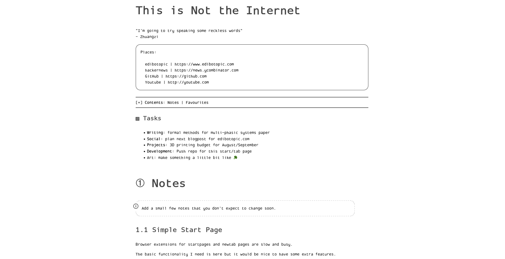

# Qute Start

A bare bones home page/new tab page that can be loaded as a local file, allows live editing and is friendly to light or dark modes.

Made for personal use and sharing across my own computers.

Developed initially for use with [qutebrowser](https://qutebrowser.org/) but has been tested with Chrome and Firefox where it has worked just as well (or better).

## Features

- Minimal text-based interface
- Live-editable text (_mostly_)
- Buttons to add new notes and tasks
- Quote, links, tasks and favourites sections as default

## Purpose

I wanted a simple, minimal homepage that opens quickly, shows some links and includes a few live-editable notes.

I also wanted to move away from home page extensions that seem to be dominated by large clocks and landscape photography.

## Using

To start `git clone` the repo and note the _path_ to the `index.html`.
In your `config.py` for qutebrowser include the following lines:

```
c.url.default_page = 'file:///home/user/yourpathto/qute-start/index.html'
c.url.start_pages = 'file:///home/user/yourpathto/qute-start/index.html'
```

For other browsers simply go into their _settings menu_ and enter the same path above for your startpage or newtab page.

The `index.html` is **my** homepage and you will want to customise it.
Currently, almost all text can be edited in the browser **except for links**.
When you edit a text element the current state of the page will be saved to _local storage_.

Buttons are included at the end of the _tasks_, _notes_ and _favourites_ sections.
Clicking these buttons will add a correctly formatted element that you can edit.
(You can also simply copy-paste elements if you wish.)

_Note: if you want to use keyboard shortcuts on the homepage (e.g., H, J, K, L movement keys in qutebrowser) you must ensure you are not focused on an editable text element and/or in insert mode._

You will probably want to create your own page from scratch, however.
If so, delete mine and rename `template.html` to `index.html`.
This will give you a skeleton startpage with placeholder text.
Edit the new `index.html` to add different links, styles, etc.

## Warning

I wouldn't advise relying on local storage for highly sensitive notes.

For security, it might be preferable to `save as` the webpage periodically and replace the `index.html` to make the changes permanent.

~~In qutebrowser you can type `gd` to invoke the _download_ command with the homepage open in the active tab.~~
~~A prompt will then ask you to find where you want to download the `index.html`.
Choose the `/qute-start/` directory and save over the original file.~~

**I'm not sure yet if the above preserves local changes**.

On Chrome or Firefox simply type <kbd>ctrl</kbd>+<kbd>s</kbd> to save the page.
Just make sure you move the file to the correct location.

## Limitations

Pull requests welcome.

### Live-editable links

Would be nice to have editable links but this needs to be done in such a way that the hyperlinks remain clickable.
Should not be too difficult but is not a priority right now.

## Credit

The `html` and `css` is inspired by the lovely [Pico-8 online manual](https://www.lexaloffle.com/dl/docs/pico-8_manual.html).

## Images

### Dark mode on qutebrowser

Shown with **darkmode** enabled in browser, **transparent** terminal and **default** text.


### Light mode on Firefox

Shown with **lightmode** enabled in browser and **edited text** (title, tasks) that are **saved locally**.



## To-do

- [ ] Bug on qutebrowser - title edits not persisting?
- [ ] Add instructions for setting defaults in different browsers
- [x] Test download page functionality (update: it's limited)
- [ ] Add rich text support
- [ ] More consistency around editability
- [ ] Theme support
- [ ] Updated images to capture latest changes
- [ ] Consider a readme .gif
